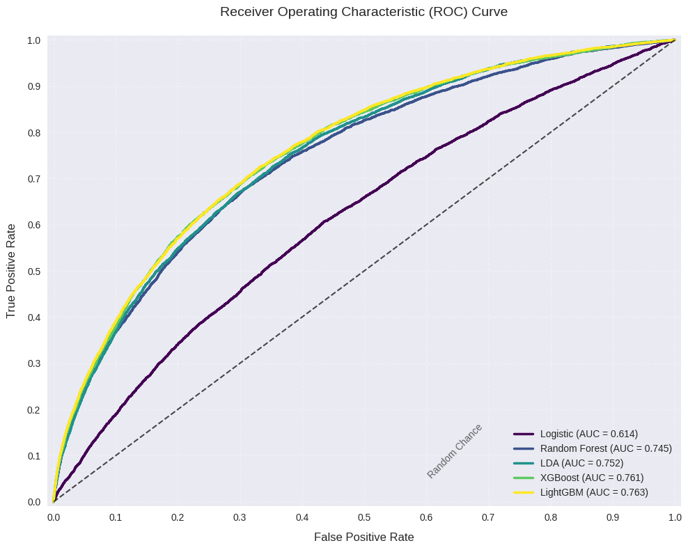

# Home Credit Default Risk

This project aims to manipulate Machine Learning models to predict the default probability of clients, based on multiple datasets showcasing the clients' credit record.

# Skills
Python | Feature Engineering | Exploratory Data Analysis & Data Preprocessing | Machine Learning

# Implementation and Methodology
- **Feature Engineering**: Aggregation, merge and selection of columns based on the feature properties
- **Data Preprocessing**:
  - Handled missing and infinite values and visualized the result
  - Performed one-hot encoding on the train and test datasets
  - Explored the distribution of target labels and discovered the imbalance issue
- **Model building and evaluation**: Built multiple machine learning models, including Logistic regression, Random Forest Classifier, LDA, XGBClassifier and LightGBM, and evaluate their performance in the prediction task

# Performance
- The best model LightGBM achieved 91% accuracy and a 0.76 AUC score.
- The comparison graph is shown here:
  

# Source:
- Project with datasets from Kaggle https://www.kaggle.com/competitions/home-credit-default-risk
